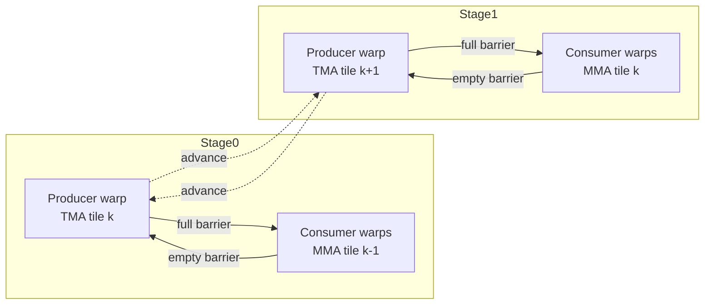

# A Beginner's Tour of CUTLASS 3.x GEMM Pipelines (Hopper+/SM90)

New to CUTLASS and wondering how the GEMM mainloop keeps Tensor Cores busy while data streams from global memory? This guide walks through the pipeline helpers in `cutlass/pipeline`, shows where warp-specialization fits, and uses annotated code snippets and diagrams so you can connect the high-level concepts to real headers.

> **Scope.** The examples reference the SM90+ pipeline utilities introduced for Hopper-class GPUs. Older architectures use different helpers but the ideas (producer/consumer stages and barrier hand-offs) are similar.

---

## 1) Why a pipeline exists at all

A GEMM kernel juggles two expensive activities:

1. **Loading tiles of A/B/C** from global memory into shared memory (SMEM) using TMA or `cp.async`.
2. **Issuing Tensor Core MMA** on already-loaded tiles.

Rather than serialize those tasks, CUTLASS sets up a **producer/consumer pipeline** so memory transfers for the next tile overlap with math on the current tile. Depth is controlled by the `Stages` template parameter in the mainloop.

### Minimal mental model
```
while (k_tiles_left) {
  producer loads tile[k + pipeline_depth];
  consumer computes MMA on tile[k];
  barriers ensure compute never reads a slot while producer overwrites it;
}
```

---

## 2) The core building blocks

### 2.1 `PipelineState`
Tracks the circular stage index (`stage_idx`), a phase bit for barriers (`phase`), and a running iteration count. Advancing rolls over the stage and toggles phase so producer/consumer stay in sync across the ring buffer.【F:include/cutlass/pipeline/sm90_pipeline.hpp†L230-L259】 Helper factories like `make_producer_start_state` set the producer one phase ahead so it can fill an empty pipe.【F:include/cutlass/pipeline/sm90_pipeline.hpp†L252-L259】

### 2.2 Barrier-backed TMA pipeline (`PipelineTmaAsync`)
Used by SM90 GEMM/conv mainloops that move tiles with TMA:

* **Barriers:** Paired arrays `full_barrier_` (consumer waits) and `empty_barrier_` (producer waits) live in SMEM. Initialization seeds arrival counts for every stage and, on clusters, distributes which threads signal each destination block to reduce contention.【F:include/cutlass/pipeline/sm90_pipeline.hpp†L271-L376】
* **Producer path:** `producer_try_acquire`/`producer_acquire` wait on `empty_barrier_` for a free slot; the leader thread issues `tma::expect` and `tma::commit` (or `producer_commit`), then advances the pipeline state.【F:include/cutlass/pipeline/sm90_pipeline.hpp†L530-L642】
* **Consumer path:** `consumer_wait` waits on `full_barrier_`, does MMA on the tile for that stage, then `consumer_release` arrives on `empty_barrier_` so the producer can reuse it.【F:include/cutlass/pipeline/sm90_pipeline.hpp†L530-L642】

### 2.3 Store pipeline (`PipelineTmaStore`)
Mirrors the TMA load pipeline for epilogues, letting you throttle how many store batches are in flight (`UnacquiredStages`) before blocking, which overlaps writeback with math.【F:include/cutlass/pipeline/sm90_pipeline.hpp†L646-L708】

### 2.4 Lightweight async pipeline (`PipelineAsync`)
For kernels using `cp.async` or non-TMA traffic, `PipelineAsync` provides the same acquire/commit/wait/release choreography on plain cluster barriers, parameterized by producer/consumer roles.【F:include/cutlass/pipeline/sm90_pipeline.hpp†L1040-L1234】

---

## 3) Seeing the pipeline inside a GEMM mainloop

A typical SM90 GEMM mainloop specialization wires the pipeline into a loop over K tiles. The pseudo-flow matches the real CUTLASS helpers (comments reference the header so you can explore further):

```cpp
// Pseudocode distilled from SM90 GEMM mainloops
PipelineState ps = PipelineState::make_initial(kStages); // stage=0, phase=0
pipeline.producer_arrive(ps); // pre-fill barriers

for (int k_iter = 0; k_iter < kTileCount; ++k_iter) {
  // 1) Producer warp: acquire a free stage and launch TMA copy
  if (is_producer) {
    pipeline.producer_acquire(ps);                    // waits on empty barrier
    issue_tma_load(ps.stage_idx);                     // tma::expect/commit
    pipeline.producer_commit(ps);                     // marks full barrier
  }

  // 2) Consumer warps: wait for data, then MMA
  if (is_consumer) {
    pipeline.consumer_wait(ps);                       // waits on full barrier
    mma_on_tile(ps.stage_idx);                         // Tensor Core MMA
    pipeline.consumer_release(ps);                     // signals empty barrier
  }

  // 3) Everyone advances to the next circular stage
  ps = pipeline.advance(ps);
}
```

All real SM90 mainloops in CUTLASS follow this shape—the differences are **who plays producer**, how many stages exist, and whether TMA or `cp.async` drives movement.

---

## 4) How warp specialization plugs in

The dispatch policy chooses both **pipeline flavor** and **warp roles**. For GEMM, you will see tags in `cutlass/gemm/dispatch_policy.hpp`:

* `KernelTmaWarpSpecialized` → one producer warp, multiple consumer warps.【F:include/cutlass/gemm/dispatch_policy.hpp†L70-L84】
* `KernelTmaWarpSpecializedPingpong` → two producer warps that alternate by stage (ping-pong).【F:include/cutlass/gemm/dispatch_policy.hpp†L84-L96】
* `KernelTmaWarpSpecializedCooperative` → producer duties are distributed across a cluster, letting several CTAs feed the same shared tiles.【F:include/cutlass/gemm/dispatch_policy.hpp†L96-L122】

The convolution dispatcher (`cutlass/conv/dispatch_policy.hpp`) forwards similar tags for implicit GEMM conv kernels, so the same pipeline machinery is reused.【F:include/cutlass/conv/dispatch_policy.hpp†L47-L74】

### Visualizing warp-specialized flow (two-stage example)



Producer warps stay in the TMA-heavy code path; consumer warps stay in the MMA-heavy path, reducing divergence and keeping Tensor Cores saturated once the pipe is full.

---

## 5) Understanding `Stages` and common patterns

`Stages` controls how many shared-memory buffers (and barrier pairs) the pipeline rotates through. CUTLASS defaults vary by architecture and problem shape, but the trade-offs are consistent:

* **Two-stage (double buffering)** – simplest ring. One stage is feeding MMA while the other is being filled. Hides most global→SMEM latency when TMA and MMA times are similar.
* **Three+ stages (deep buffer)** – allows multiple outstanding TMA copies. Helps when global-memory latency dominates (large K, high operand reuse) so the consumer rarely stalls waiting for data.
* **Ping-pong producer schedules** – when a single producer warp would be underutilized, alternating producer roles every stage keeps more lanes busy issuing TMA traffic at the cost of extra role bookkeeping.
* **Cluster-cooperative schedules** – for kernels that multicast tiles across CTAs, cooperative producers reduce redundant global loads and mask inter-CTA multicast latency. Barrier initialization accounts for which thread signals each destination block to avoid contention.【F:include/cutlass/pipeline/sm90_pipeline.hpp†L305-L376】
* **Epilogue store pipeline depth** – increasing `UnacquiredStages` in `PipelineTmaStore` overlaps global stores with remaining MMA/epilogue math, hiding writeback latency when C is large.【F:include/cutlass/pipeline/sm90_pipeline.hpp†L646-L708】

---

## 6) What latency is being hidden?

* **Global → shared transfer time** – `producer_acquire` waits for an empty slot; once TMA is in flight, the consumer keeps using older stages until the full barrier flips, masking the transfer.
* **Tensor Core issue latency** – deeper `Stages` keep a backlog of ready tiles so the consumer warp never bubbles waiting for data.
* **Shared-memory bank conflicts / barrier overhead** – distributing signaling threads and per-stage barriers reduces hot spots when multiple CTAs participate, masking some synchronization delay.【F:include/cutlass/pipeline/sm90_pipeline.hpp†L343-L376】
* **Global store completion** – store pipelines allow several write batches to proceed before blocking, overlapping writeback with ongoing math.【F:include/cutlass/pipeline/sm90_pipeline.hpp†L646-L708】

---

## 7) How to explore the code yourself

1. Start in `include/cutlass/pipeline/sm90_pipeline.hpp` for the barrier primitives and pipeline helper classes.
2. Browse GEMM dispatch tags in `include/cutlass/gemm/dispatch_policy.hpp` and map them to the pipeline flavor.
3. Look at an SM90 mainloop instantiation (e.g., `cutlass/gemm/kernel/sm90_gemm.hpp`) and search for `Stages` or `PipelineTmaAsync` to see how a concrete kernel wires producers and consumers.

Armed with these references, you can tune `Stages`, choose a dispatch policy, and understand exactly how CUTLASS keeps Tensor Cores fed on Hopper-class GPUs.
