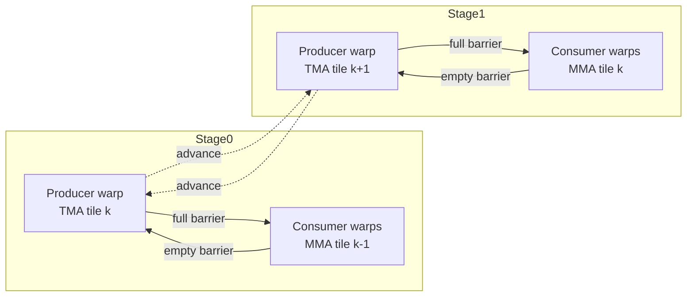

# CUTLASS 3.x GEMM 管道初学者之旅 (Hopper+/SM90)

CUTLASS 新手，想知道 GEMM 主循环如何在数据从全局内存流出时保持 Tensor Core 忙碌？本指南介绍了管道助手`cutlass/pipeline`，显示了扭曲专业化的适合位置，并使用带注释的代码片段和图表，以便您可以将高级概念连接到真实的标题。

> **范围。** 这些示例引用了为 Hopper 级 GPU 引入的 SM90+ 管道实用程序。旧的架构使用不同的助手，但想法（生产者/消费者阶段和屏障切换）是相似的。

---

## 1) 为什么存在管道

GEMM 内核兼顾两项昂贵的活动：

1. **使用 TMA 或将 A/B/C 的图块从全局内存加载到共享内存 (SMEM)`cp.async`。
2. **在已加载的图块上发布 Tensor Core MMA**。

CUTLASS 不是序列化这些任务，而是设置一个**生产者/消费者管道**，以便下一个图块的内存传输与当前图块上的数学重叠。深度由`Stages`主循环中的模板参数。

### 最小心智模型
```
while (k_tiles_left) {
  producer loads tile[k + pipeline_depth];
  consumer computes MMA on tile[k];
  barriers ensure compute never reads a slot while producer overwrites it;
}
```

---

## 2) 核心构建块

### 2.1`PipelineState`
跟踪循环阶段索引 (`stage_idx`），障碍的相位位（`phase`），以及运行的迭代计数。前进会在舞台上滚动并切换阶段，以便生产者/消费者在环形缓冲区中保持同步：

```cpp
CUTLASS_DEVICE
PipelineState& advance(uint32_t num_iterations) {
  if constexpr (Stages > 0) {
    // Number of iterations cross over the stage boundary => flipped phase
    if ((num_iterations < Stages) && (index_ + num_iterations) >= Stages ) {
      phase_ ^= 1;
    }
    // How many times number of iterations cross over the stage boundary and
    // end up on a odd number => flipped phase
    if ((num_iterations >= Stages) && (((index_ + num_iterations) / Stages) % 2) == 1) {
      phase_ ^= 1;
    }
    index_ = (index_ + num_iterations) % Stages;
    count_ += num_iterations;
  }
  return *this;
}

template<class Pipeline>
CUTLASS_DEVICE
PipelineState<Pipeline::Stages> make_producer_start_state() {
  // Producer starts with an opposite phase as the buffers are initially empty
  constexpr int InitialProducerStage = 0;
  constexpr uint32_t InitialProducerPhase = 1;
  constexpr uint32_t InitialProducerCount = 0;
  return {InitialProducerStage, InitialProducerPhase, InitialProducerCount};
}
```
[来源：`include/cutlass/pipeline/sm90_pipeline.hpp`](../include/cutlass/pipeline/sm90_pipeline.hpp)

### 2.2 Barrier-backed TMA 管道 (`PipelineTmaAsync`）
由 SM90 GEMM/conv 主循环使用，通过 TMA 移动图块：

* **屏障：** 配对数组`full_barrier_`（消费者等待）和`empty_barrier_`（制作人等待）住在 SMEM。每个阶段的初始化种子到达计数，并在集群上分配哪些线程向每个目标块发出信号以减少争用：

  ```cpp
  struct SharedStorage {
    FullBarrier full_barrier_[Stages];
    EmptyBarrier empty_barrier_[Stages];
  };

  template <class ClusterShape>
  CUTLASS_DEVICE
  static void init_barriers(SharedStorage& storage, Params params, ClusterShape cluster_shape) {
    int warp_idx = canonical_warp_idx_sync();
    bool is_initializing_warp = (warp_idx == 0);
    is_initializing_warp = (warp_idx == params.initializing_warp);
    if (is_initializing_warp) {
      uint32_t const producer_arv_cnt = params.num_producers;
      uint32_t const num_consumer_warpgroups_per_cluster = cute::ceil_div(params.num_consumers, static_cast<uint32_t>(NumThreadsPerWarpGroup));
      uint32_t multicast_consumer_arrival_count = params.num_consumers; // If cluster_size is 1
      if (cute::size(cluster_shape) > 1) {
        multicast_consumer_arrival_count = (cute::size<0>(cluster_shape) + cute::size<1>(cluster_shape) - 1) *
              num_consumer_warpgroups_per_cluster;
      }
      cutlass::arch::detail::initialize_barrier_array_pair_aligned<decltype(storage.full_barrier_), decltype(storage.empty_barrier_), Stages>(
          storage.full_barrier_, storage.empty_barrier_, producer_arv_cnt, multicast_consumer_arrival_count);
    }
    cutlass::arch::fence_barrier_init();
  }
  ```
  [来源：`include/cutlass/pipeline/sm90_pipeline.hpp`](../include/cutlass/pipeline/sm90_pipeline.hpp)

* **生产者路径：**`producer_try_acquire`/`producer_acquire`等待`empty_barrier_`获得一个免费插槽；领导线程问题`tma::expect`和`tma::commit`（或者`producer_commit`），然后推进管道状态：

  ```cpp
  CUTLASS_DEVICE
  ProducerToken producer_try_acquire(uint32_t stage, uint32_t phase, uint32_t skip_wait) {
    detail::pipeline_check_is_producer(params_.role);
    if (skip_wait) {
      return {BarrierStatus::WaitDone};
    }
    bool barrier_status = empty_barrier_ptr_[stage].try_wait(phase);
    return {static_cast<BarrierStatus>(barrier_status)};
  }

  CUTLASS_DEVICE
  void producer_acquire(uint32_t stage, uint32_t phase, ProducerToken barrier_token) {
    detail::pipeline_check_is_producer(params_.role);
    if (barrier_token != BarrierStatus::WaitDone) {
      empty_barrier_ptr_[stage].wait(phase);
    }
    if (params_.is_leader) {
      full_barrier_ptr_[stage].arrive_and_expect_tx(params_.transaction_bytes);
    }
  }
  ```
  [来源：`include/cutlass/pipeline/sm90_pipeline.hpp`](../include/cutlass/pipeline/sm90_pipeline.hpp)

* **消费者路径：**`consumer_wait`等待`full_barrier_`，在该阶段的图块上进行 MMA，然后`consumer_release`到达`empty_barrier_`这样生产者就可以重用它：

  ```cpp
  CUTLASS_DEVICE
  void consumer_wait(uint32_t stage, uint32_t phase, ConsumerToken barrier_token) {
    detail::pipeline_check_is_consumer(params_.role);
    if (barrier_token == BarrierStatus::WaitAgain) {
      full_barrier_ptr_[stage].wait(phase);
    }
  }

  CUTLASS_DEVICE
  void consumer_release(uint32_t stage, uint32_t skip = false) {
    detail::pipeline_check_is_consumer(params_.role);
    empty_barrier_ptr_[stage].arrive(dst_blockid_, is_signaling_thread_ & (!skip));
  }
  ```
  [来源：`include/cutlass/pipeline/sm90_pipeline.hpp`](../include/cutlass/pipeline/sm90_pipeline.hpp)

### 2.3 存储管道 (`PipelineTmaStore`）
镜像尾声的 TMA 加载管道，让您可以限制正在运行的商店批次数量（`UnacquiredStages`）在阻塞之前，这与数学重叠写回：

```cpp
template <int Stages_, int UnacquiredStages_ = Stages_-1>
class PipelineTmaStore {
public:
  static constexpr uint32_t Stages = Stages_;
  static constexpr uint32_t UnacquiredStages = static_cast<uint32_t>(UnacquiredStages_);
  using PipelineState = cutlass::PipelineState<Stages>;

  struct Params { bool always_wait = false; };

  CUTLASS_DEVICE
  void producer_acquire(PipelineState state) { producer_acquire(state.index(), state.count()); }

  CUTLASS_DEVICE
  void producer_commit(PipelineState state) { producer_commit(state.index(), state.count()); }

  CUTLASS_DEVICE
  void producer_tail([[maybe_unused]] PipelineState state) { tma_store_wait<0>(); }

private:
  Params params_;
  CUTLASS_DEVICE
  void producer_acquire([[maybe_unused]] uint32_t stage, uint32_t count) {
    if (params_.always_wait || count > UnacquiredStages) { tma_store_wait<UnacquiredStages>(); }
  }

  CUTLASS_DEVICE
  void producer_commit([[maybe_unused]] uint32_t stage, [[maybe_unused]] uint32_t count) {
    tma_store_arrive();
  }
};
```
[来源：`include/cutlass/pipeline/sm90_pipeline.hpp`](../include/cutlass/pipeline/sm90_pipeline.hpp)

### 2.4 轻量级异步管道（`PipelineAsync`）
对于使用内核`cp.async`或非 TMA 流量，`PipelineAsync`在普通集群屏障上提供相同的获取/提交/等待/释放编排，由生产者/消费者角色参数化。该类镜像了 TMA 助手，但初始化更简单：

```cpp
template <int Stages_>
class PipelineAsync {
public:
  struct SharedStorage {
    FullBarrier full_barrier_[Stages];
    EmptyBarrier empty_barrier_[Stages];
  };

  static CUTLASS_DEVICE void init_barriers(SharedStorage& storage, Params params) {
    int warp_idx = canonical_warp_idx_sync();
    bool is_initializing_warp = (warp_idx == params.initializing_warp);
    if (is_initializing_warp) {
      cutlass::arch::detail::initialize_barrier_array_pair_aligned<decltype(storage.full_barrier_), decltype(storage.empty_barrier_), Stages>(
          storage.full_barrier_, storage.empty_barrier_, params.producer_arv_count, params.consumer_arv_count);
    }
    cutlass::arch::fence_barrier_init();
  }
```
[来源：`include/cutlass/pipeline/sm90_pipeline.hpp`](../include/cutlass/pipeline/sm90_pipeline.hpp)

它公开了与 TMA 版本相同的包装器助手（转发到下面的私有实现）并添加了`producer_tail`保护，以便集群中的生产者块不会提前退出，而其他人仍然依赖它们：

```cpp
  CUTLASS_DEVICE
  ProducerToken producer_try_acquire(PipelineState state, uint32_t skip_wait = false) {
    return producer_try_acquire(state.index(), state.phase(), skip_wait);
  }

  CUTLASS_DEVICE
  void producer_acquire(PipelineState state, ProducerToken barrier_token = {BarrierStatus::WaitAgain}) {
    producer_acquire(state.index(), state.phase(), barrier_token);
  }

  CUTLASS_DEVICE
  void producer_commit(PipelineState state) {
    producer_commit(state.index());
  }

  template<class UserDefinedArriveOp>
  CUTLASS_DEVICE
  void producer_commit(PipelineState state, UserDefinedArriveOp&& user_defined_arrive_op) {
    cute::forward<UserDefinedArriveOp>(user_defined_arrive_op)(producer_get_barrier(state.index()));
    producer_commit(state);
  }

  // Prevents early exit of producer blocks in Cluster.
  // This should be called once before kernel exits.
  CUTLASS_DEVICE
  void producer_tail(PipelineState state) {
    for (int count = 0; count < Stages; ++count) {
      producer_acquire(state);
      ++state;
    }
  }

  CUTLASS_DEVICE
  ProducerBarrierType* producer_get_barrier(PipelineState state) {
    return producer_get_barrier(state.index());
  }

  ////////////////////
  // Consumer APIs
  ////////////////////
  CUTLASS_DEVICE
  ConsumerToken consumer_try_wait(PipelineState state, uint32_t skip_wait = false) {
    return consumer_try_wait(state.index(), state.phase(), skip_wait);
  }

  CUTLASS_DEVICE
  ConsumerToken consumer_test_wait(PipelineState state, uint32_t skip_wait = false) {
    return consumer_test_wait(state.index(), state.phase(), skip_wait);
  }

  CUTLASS_DEVICE
  void consumer_wait(PipelineState state, ConsumerToken barrier_token = {BarrierStatus::WaitAgain}) {
    consumer_wait(state.index(), state.phase(), barrier_token);
  }

  CUTLASS_DEVICE
  void consumer_release(PipelineState state) {
    consumer_release(state.index());
  }

  CUTLASS_DEVICE
  ProducerBarrierType* producer_get_barrier(uint32_t stage) {
    return reinterpret_cast<ProducerBarrierType*>(&full_barrier_ptr_[stage]);
  }
```
[来源：`include/cutlass/pipeline/sm90_pipeline.hpp`](../include/cutlass/pipeline/sm90_pipeline.hpp)

私有实现镜像了 TMA 管道，但没有 TMA 特定的到达/期望调用 - 生产者和消费者只需等待适当的屏障，然后到达将其翻转到另一侧：

```cpp
  CUTLASS_DEVICE
  ProducerToken producer_try_acquire(uint32_t stage, uint32_t phase, uint32_t skip_wait) {
    detail::pipeline_check_is_producer(params_.role);
    if (skip_wait) {
      return {BarrierStatus::WaitDone};
    }
    bool barrier_status = empty_barrier_ptr_[stage].try_wait(phase);
    return {static_cast<BarrierStatus>(barrier_status)};
  }

  CUTLASS_DEVICE
  void producer_acquire(uint32_t stage, uint32_t phase, ProducerToken barrier_token) {
    detail::pipeline_check_is_producer(params_.role);
    if (barrier_token == BarrierStatus::WaitAgain) {
      empty_barrier_ptr_[stage].wait(phase);
    }
  }

  CUTLASS_DEVICE
  void producer_commit(uint32_t stage) {
    detail::pipeline_check_is_producer(params_.role);
    full_barrier_ptr_[stage].arrive();
  }

  CUTLASS_DEVICE
  ConsumerToken consumer_try_wait(uint32_t stage, uint32_t phase, uint32_t skip_wait) {
    detail::pipeline_check_is_consumer(params_.role);
    if (skip_wait) {
      return {BarrierStatus::WaitDone};
    }
    bool barrier_status = full_barrier_ptr_[stage].try_wait(phase);
    return {static_cast<BarrierStatus>(barrier_status)};
  }

  CUTLASS_DEVICE
  ConsumerToken consumer_test_wait(uint32_t stage, uint32_t phase, uint32_t skip_wait) {
    detail::pipeline_check_is_consumer(params_.role);
    if (skip_wait) {
      return {BarrierStatus::WaitDone};
    }
    bool barrier_status = full_barrier_ptr_[stage].test_wait(phase);
    return {static_cast<BarrierStatus>(barrier_status)};
  }

  CUTLASS_DEVICE
  void consumer_wait(uint32_t stage, uint32_t phase) {
    detail::pipeline_check_is_consumer(params_.role);
    bool done = full_barrier_ptr_[stage].test_wait(phase);
    if (!done) {
      full_barrier_ptr_[stage].wait(phase);
    }
  }

  CUTLASS_DEVICE
  void consumer_wait(uint32_t stage, uint32_t phase, ConsumerToken barrier_token) {
    detail::pipeline_check_is_consumer(params_.role);
    if (barrier_token == BarrierStatus::WaitAgain) {
      full_barrier_ptr_[stage].wait(phase);
    }
  }

  CUTLASS_DEVICE
  void consumer_release(uint32_t stage) {
    detail::pipeline_check_is_consumer(params_.role);
    empty_barrier_ptr_[stage].arrive(params_.dst_blockid);
  }
};
```
[来源：`include/cutlass/pipeline/sm90_pipeline.hpp`](../include/cutlass/pipeline/sm90_pipeline.hpp)

---

## 3) 查看 GEMM 主循环内的管道

典型的 SM90 GEMM 主循环专业化将管道连接到 K 个区块上的循环中。伪流与真实的 CUTLASS 助手相匹配（注释引用标题，以便您可以进一步探索）：

```cpp
// Pseudocode distilled from SM90 GEMM mainloops
PipelineState ps = PipelineState::make_initial(kStages); // stage=0, phase=0
pipeline.producer_arrive(ps); // pre-fill barriers

for (int k_iter = 0; k_iter < kTileCount; ++k_iter) {
  // 1) Producer warp: acquire a free stage and launch TMA copy
  if (is_producer) {
    pipeline.producer_acquire(ps);                    // waits on empty barrier
    issue_tma_load(ps.stage_idx);                     // tma::expect/commit
    pipeline.producer_commit(ps);                     // marks full barrier
  }

  // 2) Consumer warps: wait for data, then MMA
  if (is_consumer) {
    pipeline.consumer_wait(ps);                       // waits on full barrier
    mma_on_tile(ps.stage_idx);                         // Tensor Core MMA
    pipeline.consumer_release(ps);                     // signals empty barrier
  }

  // 3) Everyone advances to the next circular stage
  ps = pipeline.advance(ps);
}
```

如果您想看到真实的情况，SM90 warp 专用的 GEMM 生产者 warp 会获取管道阶段，发出 TMA 流量，并以这种方式推进环形缓冲区（为简洁起见，省略调度代码）：

```cpp
while (work_tile_info.is_valid()) {
  // Producer warp preps the next stage
  collective_mainloop.load(
    params.mainloop,
    mainloop_pipeline,
    mainloop_pipe_producer_state,
    load_inputs,
    blk_coord,
    k_tile_iter, k_tile_count,
    lane_idx,
    block_rank_in_cluster,
    shared_storage.tensors.mainloop
  );
  // Update starting pipeline state for the next tile
  mainloop_pipe_producer_state.advance(k_tile_count);
}

// Make sure all Consumer Warp Groups have been waited upon
collective_mainloop.load_tail(mainloop_pipeline, mainloop_pipe_producer_state);
```
[来源：`include/cutlass/gemm/kernel/sm90_gemm_tma_warpspecialized_pingpong.hpp`](../include/cutlass/gemm/kernel/sm90_gemm_tma_warpspecialized_pingpong.hpp)

在消费者方面，数学扭曲组等待全部障碍，执行 MMA，并以相同的节奏推进其管道状态，然后再移交给尾声：

```cpp
collective_mainloop.mma(
  mainloop_pipeline,
  mainloop_pipe_consumer_state,
  accumulators,
  k_tile_count,
  warp_group_thread_idx,
  shared_storage.tensors.mainloop,
  params.mainloop
);

// Make sure the math instructions are done and free buffers before entering the epilogue
collective_mainloop.mma_tail(
  mainloop_pipeline,
  mainloop_pipe_consumer_state,
  k_tile_count
);
// Update starting mainloop pipeline state for the next tile
mainloop_pipe_consumer_state.advance(k_tile_count * NumMmaWarpGroups);
```
[来源：`include/cutlass/gemm/kernel/sm90_gemm_tma_warpspecialized_pingpong.hpp`](../include/cutlass/gemm/kernel/sm90_gemm_tma_warpspecialized_pingpong.hpp)

CUTLASS 中所有真正的 SM90 主循环都遵循这种形状 - 区别在于**谁扮演制作人**、存在多少个阶段以及是否是 TMA 或`cp.async`驱动运动。

---

## 4) 扭曲专业化如何发挥作用

调度策略选择**管道风格**和**扭曲角色**。对于 GEMM，这些标签是简单的结构`cutlass/gemm/dispatch_policy.hpp`:

```cpp
struct KernelTmaWarpSpecialized { };

struct KernelTmaWarpSpecializedPingpong {
  static constexpr int SchedulerPipelineStageCount = 0;
};

struct KernelTmaWarpSpecializedCooperative {
  static constexpr int SchedulerPipelineStageCount = 0;
};
```
[来源：`include/cutlass/gemm/dispatch_policy.hpp`](../include/cutlass/gemm/dispatch_policy.hpp)

*`KernelTmaWarpSpecialized`→ 一个生产者扭曲，多个消费者扭曲。
*`KernelTmaWarpSpecializedPingpong`→ 两个生产者扭曲按阶段交替（乒乓球）。
*`KernelTmaWarpSpecializedCooperative`→ 生产者职责分布在一个集群中，让多个 CTA 提供相同的共享块。

卷积调度器（`cutlass/conv/dispatch_policy.hpp`）为隐式 GEMM 转换内核转发相似的标签，因此可以重用相同的管道机制：

```cpp
struct KernelImplicitTmaWarpSpecializedSm90 : cutlass::gemm::KernelTmaWarpSpecialized { };
struct KernelImplicitTmaWarpSpecializedSm90Cooperative { };
struct KernelImplicitTmaWarpSpecializedSm90Pingpong { };
```
[来源：`include/cutlass/conv/dispatch_policy.hpp`](../include/cutlass/conv/dispatch_policy.hpp)

### 可视化扭曲专用流（两阶段示例）



生产者扭曲停留在 TMA 密集的代码路径中；消费者扭曲停留在 MMA 密集的路径中，减少发散并在管道充满后保持张量核心饱和。

这些策略标签不仅仅是注释——内核入口点专门研究它们并相应地导出扭曲计数、集群形状和管道存储。例如，SM90 TMA warp 专用 GEMM 内核仅在集体主循环通告匹配调度标签时参与，然后直接从调度策略中提取集群形状和管道存储布局：

```cpp
class GemmUniversal<
  ProblemShape_,
  CollectiveMainloop_,
  CollectiveEpilogue_,
  TileScheduler_,
  cute::enable_if_t<cute::is_base_of_v<cutlass::gemm::KernelTmaWarpSpecialized, typename CollectiveMainloop_::DispatchPolicy::Schedule>>
>
{
public:
  using DispatchPolicy = typename CollectiveMainloop::DispatchPolicy;
  using ClusterShape = typename DispatchPolicy::ClusterShape;

  struct SharedStorage {
    using MainloopPipelineStorage = typename CollectiveMainloop::PipelineStorage;
    alignas(16) MainloopPipelineStorage mainloop;
  };

  static constexpr uint32_t NumLoadWarpGroups = 1;
  static constexpr uint32_t NumMmaWarpGroups  = DispatchPolicy::NumMmaWarpGroups;
  static constexpr uint32_t NumWarpGroups     = NumLoadWarpGroups + NumMmaWarpGroups;
};
```
[来源：`include/cutlass/gemm/kernel/sm90_gemm_tma_warpspecialized.hpp`](../include/cutlass/gemm/kernel/sm90_gemm_tma_warpspecialized.hpp)

乒乓球和协作标签提供同级内核特化，这些特化在两个生产者扭曲或集群协作角色中交换，但周围的循环形状和第 2-3 节中的管道使用保持不变。

---

## 5) 理解`Stages`和常见模式

`Stages`控制管道轮换通过的共享内存缓冲区（和屏障对）的数量。 CUTLASS 默认值因架构和问题形状而异，但权衡是一致的：

* **两级（双缓冲）** – 最简单的环。一个阶段正在喂食 MMA，而另一阶段正在填充。当 TMA 和 MMA 时间相似时，隐藏大部分全局→SMEM 延迟。
* **三个以上阶段（深度缓冲区）** – 允许多个未完成的 TMA 副本。当全局内存延迟占主导地位（大 K、高操作数重用）时很有帮助，因此消费者很少会停止等待数据。
* **乒乓生产者时间表** – 当单个生产者扭曲未得到充分利用时，每个阶段交替生产者角色会使更多通道忙于发布 TMA 流量，但需要额外的角色簿记。
* **集群协作调度** – 对于跨 CTA 多播切片的内核，协作生产者减少冗余全局负载并掩盖 CTA 间多播延迟。屏障初始化考虑哪些线程向每个目标块发出信号以避免争用。【F:include/cutlass/pipeline/sm90_pipeline.hpp†L305-L376】
* **Epilogue 存储管道深度** – 增加`UnacquiredStages`在`PipelineTmaStore`将全局存储与剩余的 MMA/尾声数学重叠，当 C 较大时隐藏写回延迟。【F:include/cutlass/pipeline/sm90_pipeline.hpp†L646-L708】

---

## 6) 隐藏了哪些延迟？

每个管道阶段都与内存/计算时间线的不同部分重叠。下面的项目符号指出了哪些助手进行了掩蔽，并包含了小时间线，以便您可以想象为什么管道充满后气泡会消失。

* **全球 → 共享传输时间** –`producer_acquire`等待一个空槽；一次`tma::commit`发生火灾时，消费者扭曲会继续使用较旧的阶段，直到匹配的完整屏障翻转，因此 TMA 延迟隐藏在正在进行的 MMA 后面。

  ```mermaid
  gantt
    dateFormat  X
    axisFormat  %s
    section Producer
    Acquire stage0   :a1, 0, 1
    TMA stage0       :a2, 1, 3
    Acquire stage1   :a3, 3, 1
    TMA stage1       :a4, 4, 3
    section Consumer
    Wait full0       :c1, 1, 0.5
    MMA on stage0    :c2, 1.5, 2.5
    Wait full1       :c3, 4, 0.5
    MMA on stage1    :c4, 4.5, 2.5
  ```

  当第一阶段待处理时（`TMA stage0`），消费者忙于前一块瓷砖（`MMA on stage0`）。只有当两者都完成时，每个人才能前进。这种行为直接来自于`consumer_wait`/`consumer_release`每级屏障阵列上的配对。【F:include/cutlass/pipeline/sm90_pipeline.hpp†L590-L636】

* **Tensor Core 问题延迟** – 更深`Stages`保持积压的现成瓷砖，这样消费者就不会停滞不前。每次 MMA 切片后，`PipelineState::advance`旋转到下一个阶段并切换阶段位，以便在生产者保持领先一个（或多个）格的同时可以重复使用相同的障碍。【F:include/cutlass/pipeline/sm90_pipeline.hpp†L168-L260】

* **共享内存库冲突/屏障开销** – 在集群内核上，构造函数会分散向每个目标块发出信号的线程，以便到达的数据会在扭曲组中分片，而不是堆积在一个通道上。当多个 CTA 共享一个图块时，每级屏障阵列还可以避免全局争用。【F:include/cutlass/pipeline/sm90_pipeline.hpp†L343-L376】

  ```mermaid
  graph LR
    subgraph Cluster arrivals
      T0[Warp 0 lane 0] -->|arrive dst0| B0[Empty barrier stage s]
      T1[Warp 1 lane 5] -->|arrive dst1| B0
      T2[Warp 2 lane 17] -->|arrive dst2| B0
    end
    B0 -->|flip full barrier| Consumers
  ```

  像这样分布到达会掩盖每个屏障的延迟峰值，否则当多个 CTA 多播同一图块时您会看到这种情况。

* **全球商店竣工** –`PipelineTmaStore`生产者仅在超过时阻塞`UnacquiredStages`商店批次正在运输中（或当`always_wait`已设置）。这意味着写回可以在生产者线程等待之前跟踪主循环几个阶段，与MMA/尾声数学重叠存储。【F:include/cutlass/pipeline/sm90_pipeline.hpp†L646-L708】

  ```mermaid
  gantt
    dateFormat  X
    axisFormat  %s
    section Epilogue warp
    Issue store batch0    :s1, 0, 1
    Issue store batch1    :s2, 1, 1
    Issue store batch2    :s3, 2, 1
    Wait (acquire)        :s4, 3, 0.5
    section TMA unit
    Commit batch0         :t1, 0, 2
    Commit batch1         :t2, 1, 2
    Commit batch2         :t3, 2, 2
  ```

  仅在之后`UnacquiredStages`批次未完成`producer_acquire`强制等待，让存储硬件耗尽，同时扭曲继续在其他图块上进行尾声数学计算。

---

## 7) 如何自己探索代码

1. 开始于`include/cutlass/pipeline/sm90_pipeline.hpp`用于屏障原语和管道辅助类。
2.浏览GEMM调度标签`include/cutlass/gemm/dispatch_policy.hpp`并将它们映射到管道风格。
3. 查看 SM90 主循环实例化（例如，`cutlass/gemm/kernel/sm90_gemm.hpp`）并搜索`Stages`或者`PipelineTmaAsync`看看具体的内核如何连接生产者和消费者。

有了这些参考资料，您就可以调整`Stages`，选择调度策略，并准确了解 CUTLASS 如何让 Tensor Core 在 Hopper 级 GPU 上运行。
